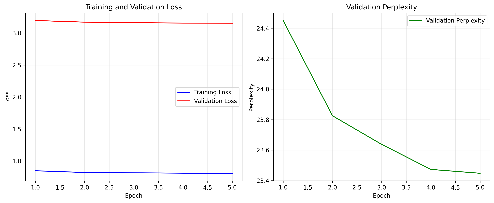
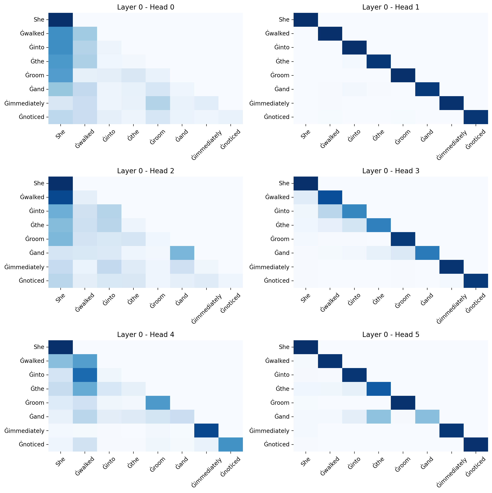
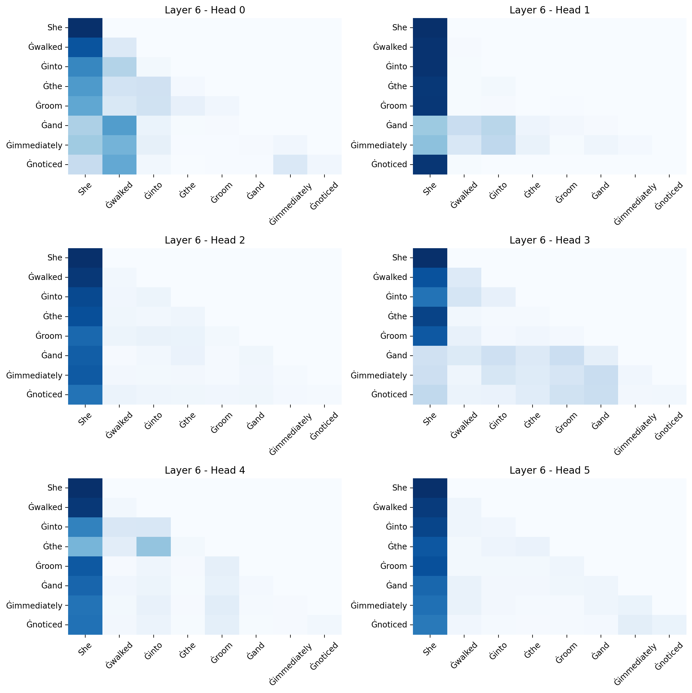
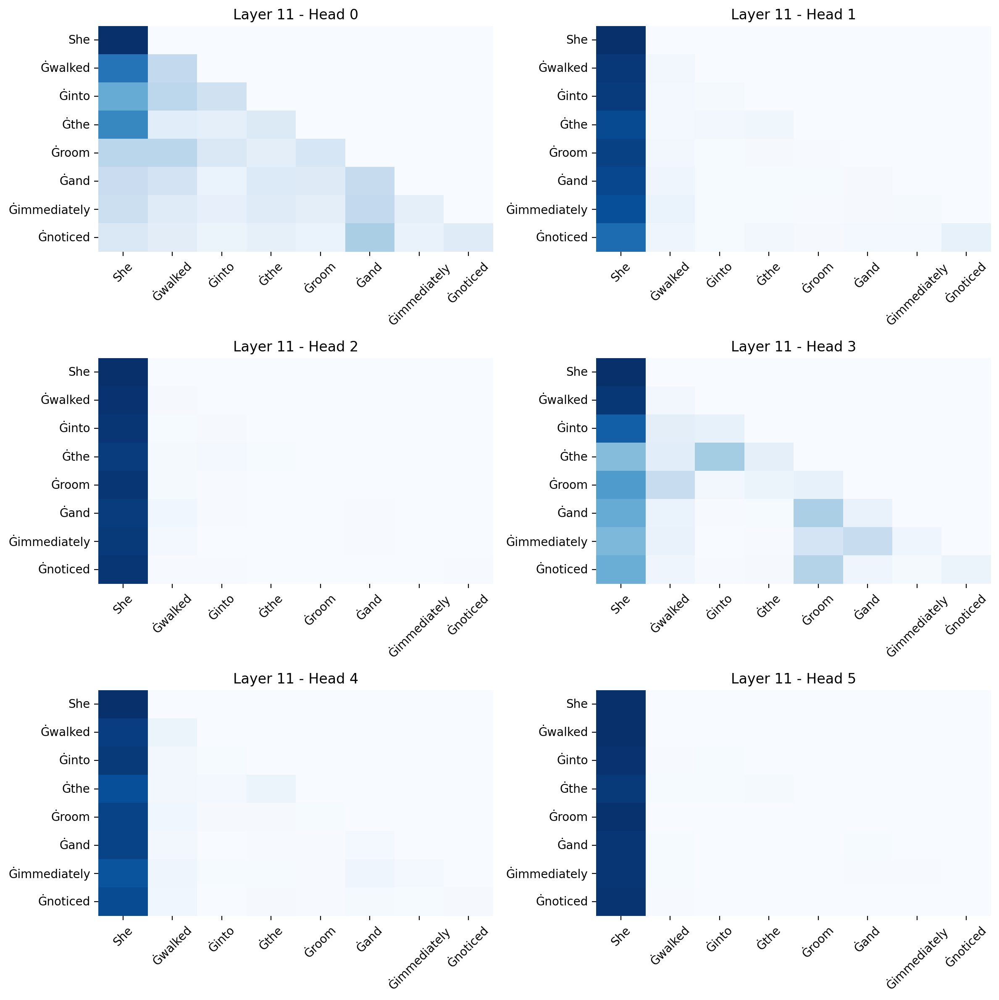
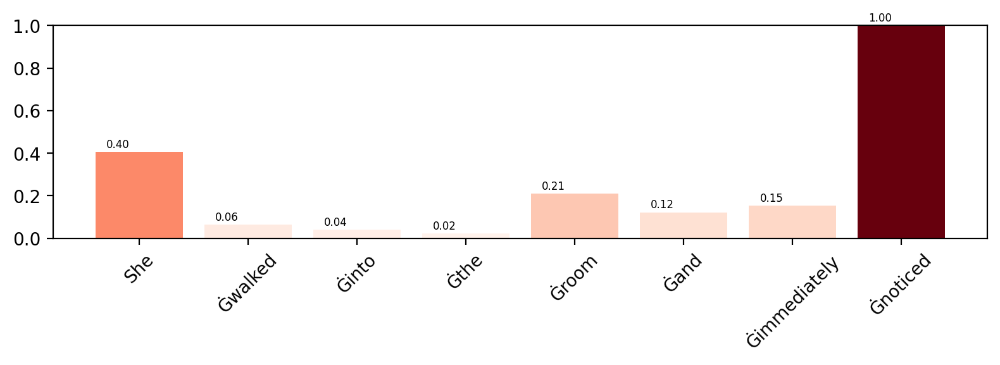
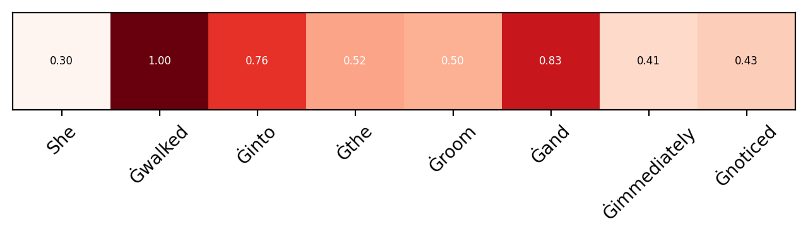

# CreativeWritingGPT: A Fine-tuned Model for Creative Text Generation

A specialized GPT-2 model fine-tuned for creative writing tasks using LoRA (Low-Rank Adaptation), with comprehensive interpretability analysis to understand model behavior in creative text generation.

## Features

- **Creative Writing Specialization**: Fine-tuned on creative writing datasets for improved storytelling
- **Efficient Fine-tuning**: Uses LoRA for parameter-efficient training on creative text
- **Multi-genre Training**: Combines WritingPrompts, ROC Stories, WikiText, and OpenWebText for diverse creative capabilities
- **Comprehensive Interpretability**: Attention visualization, gradient-based analysis, and perturbation studies
- **Cross-platform Support**: Works on CPU, CUDA, and Apple Silicon (MPS)
- **Interactive Generation**: Command-line interface for creative text generation

## Installation

```bash
# Clone the repository
git clone https://github.com/roger130/TextGen.git
cd TextGen

# Install dependencies
pip install torch transformers peft datasets matplotlib seaborn captum tqdm numpy
```

## Project Structure

```
├── config.py          # Configuration settings
├── model.py           # LoRA model setup
├── dataset.py         # Multi-dataset loader for creative writing
├── train.py           # Training pipeline
├── evaluate.py        # Model evaluation
├── generate.py        # Creative text generation interface
├── analysis.py        # Interpretability analysis
└── utils.py           # Utility functions
```

## Quick Start

### 1. Training

```bash
python train.py
```

This will:
- Load and combine multiple creative writing datasets
- Fine-tune GPT-2 with LoRA adapters
- Save the best model based on validation loss
- Generate training curves and metrics

### 2. Creative Text Generation

```bash
python generate.py
```

Interactive generation with creative writing examples and custom prompts.

## Training Results

<!-- Insert training curves and metrics here -->
*Training loss and validation perplexity curves will be displayed here*



## Generation Examples

<!-- Insert example generations here -->

### Example 1: Fantasy Story
**Prompt**: "Once upon a time in a kingdom far away,"

**Generated Text**:
```
"Once upon a time in a kingdom far away from its homeland, the kingdom of God chose the young man who was to be his heir. The young man chose his father, whom he loved dearly. This young man, now his heir, was the son of a man who had passed away in the past. A year had passed since the King chose the young man for his heir. The young man's mother, now her last wish, was slain in battle. The King, a man who had loved his father dearly, was sent to fight to the death to protect his father from the plague. The young man was buried in a pit and buried with the King's body. A few days later, the King's mother was slain and his father"
```

### Example 2: Science Fiction
**Prompt**: "The future of artificial intelligence"

**Generated Text**:
```
"The future of artificial intelligence is likely to be a big topic of debate among researchers.\n\nA new study from MIT's Institute for Artificial Intelligence and Machine Learning, which is affiliated with the International Institute for Computational Biology, shows that researchers in the United States are already developing software that could help humans in certain tasks.\n\nIn this study, researchers analyzed computer programs that perform tasks such as search and recall, which are used to improve human cognitive performance."
```

### Example 3: Mystery/Thriller
**Prompt**: "In a world where magic was forbidden,"

**Generated Text**:
```
"In a world where magic was forbidden, the magical world was in danger of becoming a war zone. A group of sorcerers and wizards began to battle the warlords. One wizard managed to break the spell in his hand and win the war. The warlord called a truce and the war was over. A few years later, the warlord called a truce. The warlords had finally broken their spell and now the warlord's magic had been banished.\n\nMagic is not magic, but a war zone. When magic is banned, magic is the result of the war that created magic. Today, Magic is outlawed in the United States. Today, Magic is banned in countries like France, Russia, and China. Magic is illegal in the Middle East, as well. Magic is prohibited in the West, as well. Magic is banned in every country, including Japan. Magic is banned in all places in the world, including the United States. Magic is banned in China and Russia."
```

## Model Performance

<!-- Insert performance metrics table here -->

| Metric | Value |
|--------|-------|
| Final Training Loss | 0.471 |
| Validation Perplexity | 23.51 |
| Trainable Parameters | ~0.37% of total |
| Training Time | 6h |

### 3. Model Analysis

```bash
python analysis.py
```

Generates comprehensive interpretability visualizations including attention heatmaps, gradient-based token importance, and perturbation analysis.

## Configuration

Modify `config.py` to customize training parameters:

```python
@dataclass
class Config:
    # Model settings
    model_name: str = "gpt2"
    max_length: int = 512
    
    # LoRA parameters
    lora_r: int = 8
    lora_alpha: int = 16
    lora_dropout: float = 0.1
    
    # Training settings
    batch_size: int = 8
    learning_rate: float = 5e-4
    num_epochs: int = 5
    
    # Data settings
    train_size: int = 20000
    val_size: int = 2000
```

## Dataset Sources

The training pipeline automatically combines creative writing data from:

- **WritingPrompts**: Creative writing prompts and stories for narrative generation
- **ROC Stories**: Common sense story completion for coherent storytelling
- **WikiText-103**: Wikipedia articles for general knowledge and diverse topics
- **OpenWebText**: Web text for varied writing styles and creative patterns

## Interpretability Analysis Results

<!-- Insert interpretability visualizations here -->

### Attention Patterns in Creative Writing
*Analysis of how the model attends to different story elements*





### Token Importance Analysis
*Understanding which words drive creative generation*




## Interpretability Methods

### 1. Attention Visualization
- Extracts attention weights from all layers and heads
- Visualizes attention patterns as heatmaps for creative text understanding
- Shows how the model focuses on narrative elements, characters, and plot devices

### 2. Integrated Gradients
- Computes token importance using gradient-based attribution
- Identifies which input tokens most influence creative generation
- Provides normalized importance scores for understanding creative decision-making

### 3. Perturbation Analysis
- Measures importance by randomly replacing tokens in creative contexts
- Calculates KL divergence from original creative predictions
- Robust alternative to gradient-based methods for story generation analysis

## Output Structure

```
outputs/
├── best_model/         # Best checkpoint during training
├── final_model/        # Final model after training
├── metrics.json        # Training metrics
└── training_curves.png # Loss and perplexity plots

results/
├── attention_layer*.png    # Attention visualizations
├── gradients.png          # Token importance (gradients)
├── perturbation.png       # Token importance (perturbation)
└── results.json           # Numerical results
```

## Key Features

### Parameter-Efficient Creative Training
- Uses LoRA adapters to fine-tune only ~0.37% of parameters for creative writing
- Significantly reduces memory requirements while maintaining creative quality
- Enables efficient adaptation to creative writing styles and narrative patterns

### Multi-Method Creative Analysis
- **Attention Patterns**: Understand how the model focuses on story elements
- **Gradient Attribution**: See which tokens drive creative decisions
- **Perturbation Studies**: Measure robustness to changes in creative prompts

### Cross-Platform Compatibility
- Automatic device detection (CPU/CUDA/MPS)
- Optimized for Apple Silicon with MPS backend
- Configurable batch sizes based on available hardware

## Advanced Usage

### Custom Creative Dataset Integration

Add your own creative writing dataset to `dataset.py`:

```python
# In MultiDataset.__init__()
try:
    creative_data = load_dataset("your-creative-dataset")
    creative_list = []
    for item in creative_data:
        # Process your creative writing data
        if is_creative_content(item):
            creative_list.append(processed_text)
    all_samples += creative_list
except:
    pass
```

### Creative Analysis Customization

Modify analysis parameters for creative writing in `analysis.py`:

```python
# Analyze layers most relevant to creativity
layers_to_plot = [0, 6, 11]  # Input, middle creative, output layers

# Focus on creative generation patterns
creative_sentences = [
    "The enchanted castle held secrets that",
    "As the spaceship descended, the crew realized",
    "The detective's final clue revealed that"
]
```

## Performance Considerations

- **Memory Usage**: LoRA reduces memory requirements by ~75% for creative writing fine-tuning
- **Training Speed**: Gradient accumulation enables larger effective batch sizes for creative datasets
- **Creative Quality**: Specialized training maintains narrative coherence and creative diversity
- **Device Optimization**: Automatic configuration for different hardware setups

## Troubleshooting

### Common Issues

1. **CUDA Out of Memory**: Reduce `batch_size` in config
2. **Dataset Loading Errors**: Check internet connection for HuggingFace datasets
3. **MPS Issues**: Set `device="cpu"` in config if MPS causes problems

### Performance Tips

- Use gradient accumulation for larger effective batch sizes
- Enable mixed precision on compatible hardware
- Adjust `num_workers` in DataLoader for your system

## Citation

If you use this code in your research, please cite the relevant papers:

```bibtex
@article{hu2021lora,
  title={LoRA: Low-Rank Adaptation of Large Language Models},
  author={Hu, Edward J and Shen, Yelong and Wallis, Phillip and Allen-Zhu, Zeyuan and Li, Yuanzhi and Wang, Shean and Wang, Lu and Chen, Weizhu},
  journal={arXiv preprint arXiv:2106.09685},
  year={2021}
}

@inproceedings{sundararajan2017axiomatic,
  title={Axiomatic attribution for deep networks},
  author={Sundararajan, Mukund and Taly, Ankur and Yan, Qiqi},
  booktitle={International conference on machine learning},
  pages={3319--3328},
  year={2017}
}
```

